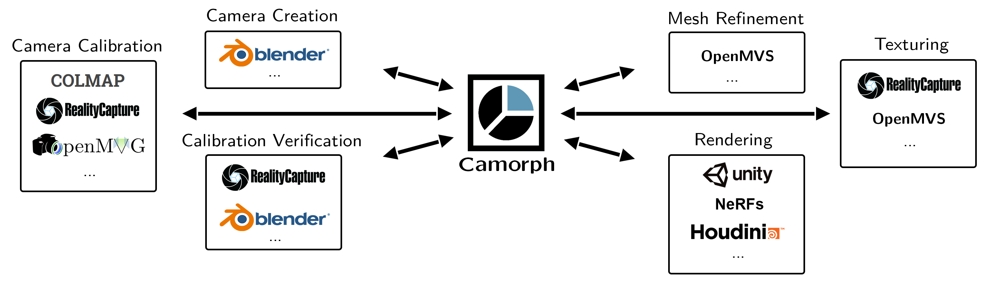

# Camorph
<font size=5>

[Paper](https://www.int-arch-photogramm-remote-sens-spatial-inf-sci.net/XLVIII-2-W1-2022/29/2022/isprs-archives-XLVIII-2-W1-2022-29-2022.pdf)
</font>
<center>

</center>

This is the gitlab project for camorph, a camera parameter converting tool written in python 3.9.

## Release Notes
### v0.3.5 (September 2, 2024)
* Fixed an issue with FULL_OPENCV models when writing binary COLMAP files
### v0.3.4 (June 20, 2024)
* Fixed an issue with shallow copying in the read_file() for NeRF when using individual image resolutions

## Documentation

Documentation can be found [here](docs/index.md).

## Quickstart

Some quick tips on how to use camorph.

### Installation

If you want to work on camorph, clone the repo and install the conda environment by running

```
conda env create -f camorph_win.yml
```

Otherwise, you can also install camorph with pip

```
pip install git+https://github.com/Fraunhofer-IIS/camorph
```

### Usage as Python Library

Use the library to convert camera parameter representations:

```
import camorph.camorph as camorph
 
 
cams = camorph.read_cameras('COLMAP',r'\\path\to\colmap')
 
camorph.visualize(cams)
 
camorph.write_cameras('fbx', r'\\path\to\file.fbx', cams)
```

``camorph.read_cameras()`` takes a format name and path as a string and returns a list of Cameras.

``camorph.visualize()`` creates a visualization of Cameras with Matplotlib.

``camorph.write_cameras()`` takes a format name, a path as a string and a list of cameras and writes the output file(s) to the specified path.

### Usage as CLI

You can use the command line interface by calling
```
python -m camorph -h
```
or when installed with pip
```
camorph -h
```
This will output the help for the command line interface

```
usage: camorph [-h] -i input_path [input_path ...] -if input_format [-o output_path] [-of output_format] [-v]
               [-c config] [-ft file_type] [-pt] [-cr crop] [-s scale] [-id image_dir] [-ci]

Convert Cameras from different formats to each other

optional arguments:
  -h, --help            show this help message and exit
  -i input_path [input_path ...], --input input_path [input_path ...]
                        the input path of the camera file(s) to read
  -if input_format, --input_format input_format
                        the format of the input camera file(s)
  -o output_path, --output output_path
                        the output path where the camera file(s) should be saved
  -of output_format, --output_format output_format
                        the format of the output camera file(s)
  -v, --visualize       when this parameter is present, the cameras will be visualized.
  -c config, --config config
                        the path to a config.json file for missing crucial properties
  -ft file_type, --file_type file_type
                        some formats support different types of output files, for example bin for binary and txt for
                        ascii files
  -pt, --posetrace      treat the input as a posetrace and ignore any source images.
  -cr crop, --crop crop
                        crop source image attributes by the specified top left and bottom right corner. Format:
                        "leftcorner_x,leftcorner_y,rightcorner_x,rightcorner_y". ATTENTION: THIS DOES NOT MODIFY THE IMAGES, ONLY THE PROPERTIES IN THE FILE!
  -s scale, --scale scale
                        scale source image attributes by the specified factor. ATTENTION: THIS DOES NOT MODIFY THE IMAGES, ONLY THE PROPERTIES IN THE FILE!
  -id image_dir, --image-dir image_dir
                        replace the directory for the source images with this.
  -ci, --check-images   check if images exist and are of the right resolution.
```

For example

```
camorph -i \path\to\json -if nerf -o \path\to\output -of fbx
```

### Crucial Properties
If there are missing crucial properties, camorph will automatically create a `config.json` in the target folder.
To edit this file, please refer to the ["Crucial Properties" section of the documentation](docs/sphinx/crucial_properties.md)

### Pose Trace
If you want to convert a camera animation, which does not have source images (sometimes also referred to as *pose trace*), you can add the `-pt` argument to ignore any source image requirements.

### Cropping and Scaling
This option crops and scales the **attributes of images in the file**. For example, colmap stores the resolution of the images, which can be modified by this parameter.
> ❗❗❗ **THIS DOES NOT MODIFY THE IMAGES THEMSELVES!** ❗❗❗

## Currently Supported Formats

- Computer Graphics
   - **FBX** (Key: "fbx")

- Photogrammetry
   - **COLMAP** (Key: "colmap")
   - **Meshroom** (Key: "meshroom")
   - **Reality Capture** (Key: "reality_capture")
   - **Local Light Field Fusion** (Key: "llff")

- Game Engines
   - **Unity** (Key: "unity")

- Virtual Reality
   - **MPEG OMAF** (Key: "mpeg_omaf")

- Machine Learning
   - **NeRF** (Key: "nerf")

## Citation 

```
@article{Brand2022CAMORPHAT,
  title={CAMORPH: A TOOLBOX FOR CONVERSION BETWEEN CAMERA PARAMETER
CONVENTIONS},
  author={B. Brand and Michel B{\"a}tz and Joachim Keinert},
  journal={The International Archives of the Photogrammetry, Remote Sensing and Spatial Information Sciences},
  year={2022}
}
```
