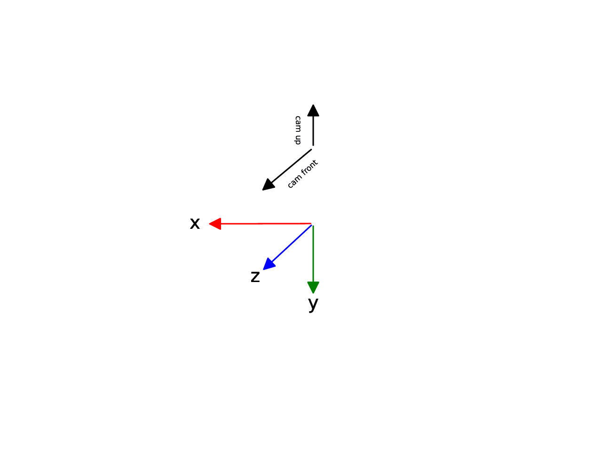

COLMAP
======
is a 3D reconstruction software developed by Johannes L. Schönberger [1]_ [2]_ .
The software stores its results in multiple files: A ``cameras`` file
containing intrinsic parameters, an ``images`` file containing extrinsic
parameters and a ``points3d`` file containing all reconstructed 3D
points. The files can be in binary format for faster processing or in
ASCII format for human readability.

Coordinate system
-----------------

The default COLMAP coordinate system is z front, -x right and -y up. The default camera direction is z and camera up is -y:

Cameras file
------------
Example cameras ASCII file:

.. code-block::

    camera_id camera_model image_width image_height params*
    1 SIMPLE_PINHOLE 3072 2304 2559.81 1536 1152
    2 PINHOLE 3072 2304 2560.56 2560.56 1536 1152
    3 SIMPLE_RADIAL 3072 2304 2559.69 1536 1152 -0.0218531

Images file
-----------
Example images ASCII file:

.. code-block::

    imageId, qw, qx, qy, qz, tx, ty, tz, cameraId, name
    points2d[] as (x,y,pointid)
    1 0.9238795391929062 0.38268341623423263 -0.0 -0.0 -5.041089999999998 1.2708298199999997 1.4063895899999999 1 \\netapp01\bt\Orga\Mitarbeiter\brandbn\BA\02_Research\Formats\COLMAP_txt\source_images\view1.png
    0 0 0 0 0 0 0 0 0
    2 0.7071067811865475 -0.0 0.7071067811865475 -0.0 0.0506335 1.94183 0.594955 2 \\netapp01\bt\Orga\Mitarbeiter\brandbn\BA\02_Research\Formats\COLMAP_txt\source_images\view1.png
    0 0 0 0 0 0 0 0 0
    3 0.9238795391929062 -0.0 -0.0 -0.38268341623423263 -3.779291409999999 3.3067953399999994 0.042054899999999985 3 \\netapp01\bt\Orga\Mitarbeiter\brandbn\BA\02_Research\Formats\COLMAP_txt\source_images\view1.png
    0 0 0 0 0 0 0 0 0

Note that the rotation :math:`R` and the translation :math:`t` are given by:

.. math::

    R = R_c^{-1} \\
    t = -Rt_c

where :math:`R_c` is the rotation matrix built from the quaternion in the images file, and :math:`t_c` is the translation vector in the images file

Camera models
-------------
COLMAP supports the following camera models:

+--------+------------------+------------------+------------------+
| **ID** | **Name**         | **Description**  | **Parameters (in |
|        |                  |                  | order)**         |
+========+==================+==================+==================+
| 0      | SIMPLE_PINHOLE   | Simple model     | f, cx, cy        |
|        |                  | without          |                  |
|        |                  | distortion       |                  |
+--------+------------------+------------------+------------------+
| 1      |   PINHOLE        | Simple model     | fx, fy, cx, cy   |
|        |                  | without          |                  |
|        |                  | distortion but   |                  |
|        |                  | two focal length |                  |
|        |                  | parameters       |                  |
+--------+------------------+------------------+------------------+
| 2      | SIMPLE_RADIAL    | Radial model     | f, cx, cy, k     |
|        |                  | with one         |                  |
|        |                  | distortion       |                  |
|        |                  | parameter.       |                  |
|        |                  | Similar to       |                  |
|        |                  | VisualSfM, with  |                  |
|        |                  | the difference   |                  |
|        |                  | that the         |                  |
|        |                  | distortion is    |                  |
|        |                  | applied to the   |                  |
|        |                  | projections      |                  |
+--------+------------------+------------------+------------------+
| 3      |   RADIAL         | Radial model     | f, cx, cy, k1,   |
|        |                  | with two         | k2               |
|        |                  | distortion       |                  |
|        |                  | parameters. The  |                  |
|        |                  | same model that  |                  |
|        |                  | Bundler          |                  |
|        |                  | uses             |                  |
+--------+------------------+------------------+------------------+
| 4      |   OPENCV         | A simple brown   | fx, fy, cx, cy,  |
|        |                  | camera model     | k1, k2, p1, p2   |
|        |                  | with two radial  |                  |
|        |                  | and two          |                  |
|        |                  | tangential       |                  |
|        |                  | distortion       |                  |
|        |                  | parameters       |                  |
+--------+------------------+------------------+------------------+
| 5      | OPENCV_FISHEYE   | An OpenCV        | fx, fy, cx, cy,  |
|        |                  | fisheye camera   | k1, k2, k3, k4   |
|        |                  | model with two   |                  |
|        |                  | radial and two   |                  |
|        |                  | tangential       |                  |
|        |                  | distortion       |                  |
|        |                  | parameters       |                  |
+--------+------------------+------------------+------------------+
| 6      |   FULL_OPENCV    | The full OpenCV  | fx, fy, cx, cy,  |
|        |                  | camera model     | k1, k2, p1, p2,  |
|        |                  | with six radial  | k3, k4, k5, k6   |
|        |                  | and two          |                  |
|        |                  | tangential       |                  |
|        |                  | distortion       |                  |
|        |                  | parameters       |                  |
|        |                  |                  |                  |
+--------+------------------+------------------+------------------+
| 7      |   FOV            | The field of     | fx, fy, cx, cy,  |
|        |                  | view distortion  | omega            |
|        |                  | model used in    |                  |
|        |                  | project tango    |                  |
|        |                  | and described by |                  |
|        |                  | Klein et.        |                  |
|        |                  | al.              |                  |
+--------+------------------+------------------+------------------+
| 8      | SIMPLE           | A simple OpenCV  | f, cx, cy, k     |
|        | _RADIAL_FISHEYE  | fisheye model    |                  |
|        |                  | with one radial  |                  |
|        |                  | distortion       |                  |
|        |                  | coefficient      |                  |
+--------+------------------+------------------+------------------+
| 9      | RADIAL_FISHEYE   | A simple OpenCV  | f, cx, cy, k1,   |
|        |                  | fisheye model    | k2               |
|        |                  | with two radial  |                  |
|        |                  | distortion       |                  |
|        |                  | coefficients     |                  |
+--------+------------------+------------------+------------------+
| 10     | THIN             | A camera model   | fx, fy, cx, cy,  |
|        | _PRISM_FISHEYE   | with radial and  | k1, k2, p1, p2,  |
|        |                  | tangential       | k3, k4, sx1, sy1 |
|        |                  | distortion       |                  |
|        |                  | coefficients and |                  |
|        |                  | additional       |                  |
|        |                  | thin-prism       |                  |
|        |                  | distortion       |                  |
|        |                  | coefficients as  |                  |
|        |                  | described by     |                  |
|        |                  | Weng et.         |                  |
|        |                  | al.              |                  |
+--------+------------------+------------------+------------------+

.. [1]
   Schönberger, Johannes Lutz and Frahm, Jan-Michael. "Structure-from-Motion
   Revisited". In: `Conference on Computer Vision and Pattern Recognition (CVPR)`.
   Las Vegas, NV, USA, June 2016.

.. [2]
   Schönberger, Johannes Lutz et al. "Pixelwise View Selection for Unstructured
   Multi-View Stereo". In: `European Conference on Computer Vision (ECCV)`. The
   Netherlands, Amsterdam, Oct. 2016