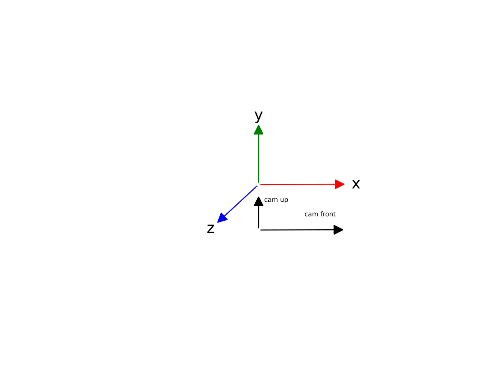

FBX
===

FBX is a proprietary file format by `Autodesk`. Because of this, there is little information publicly available.

Coordinate System
-----------------
The coordinate system in FBX can be set individually for each FBX file.
The standard definition is y-up, x-right,
z-front and the default camera orientation is x-front
y-up

File Structure
--------------
Blender published their findings for the binary file structure of an FBX file in a `blogpost <https://code.blender.org/2013/08/fbx-binary-file-format-specification/>`_ in 2014.

.. attention:: \ \

    When the FBX version is greater than 7500 which was released in
    2016, some important changes need to be
    made:

    -  The NULL blocks after nested nodes are 25 bytes, not 13

    -  The node metadata fields ``EndOffset``, ``NumProperties`` and
       ``PropertyListLen`` switch from ``uint32`` to ``uint64``

