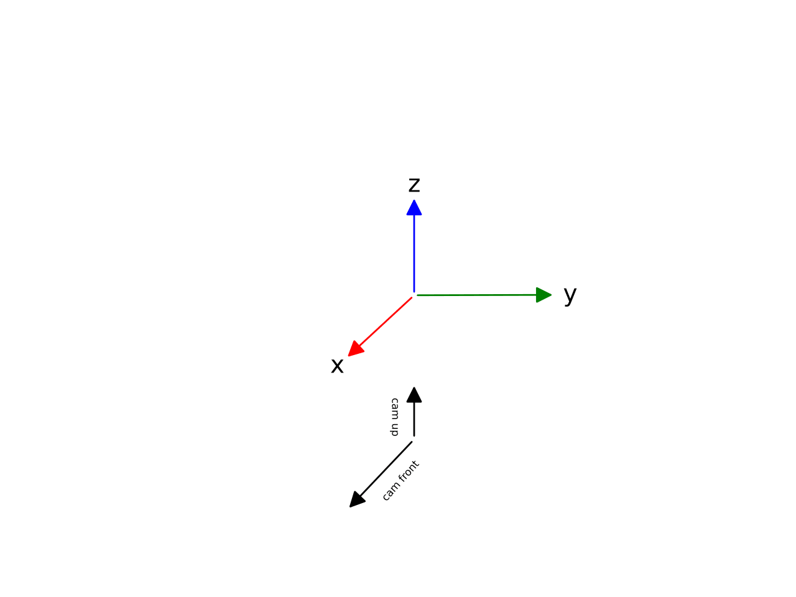

MPEG OMAF
=========
The *Moving Picture Experts Group* developed the *Omnidirectional Media
Format (OMAF)* in the standard *MPEG-I* to facilitate easy
interoperability between different devices, components and systems.

Coordinate System
-----------------
The standard *MPEG OMAF* coordinate system is z up,
y right, x front. The camera orientation is
x front and z up

JSON File
---------

-  The ``cameras`` array holds the important information for camorph

-  ``Name`` is a unique name of the camera

-  ``Projection`` is either ``Perspective`` or ``Equirectangular``. Only
   perspective projections are subject of this thesis

-  ``Position`` is the position of the camera

-  ``Resolution`` is the Resolution of the camera

-  ``Rotation`` is the rotation of the camera represented as three Euler
   angles around :math:`z,y,x` with a rotational order of :math:`x-y-z`

-  ``Focal`` is the focal length in pixels in each direction

-  ``Principle_point``\ (sic) is the principal point expressed as pixel
   coordinates