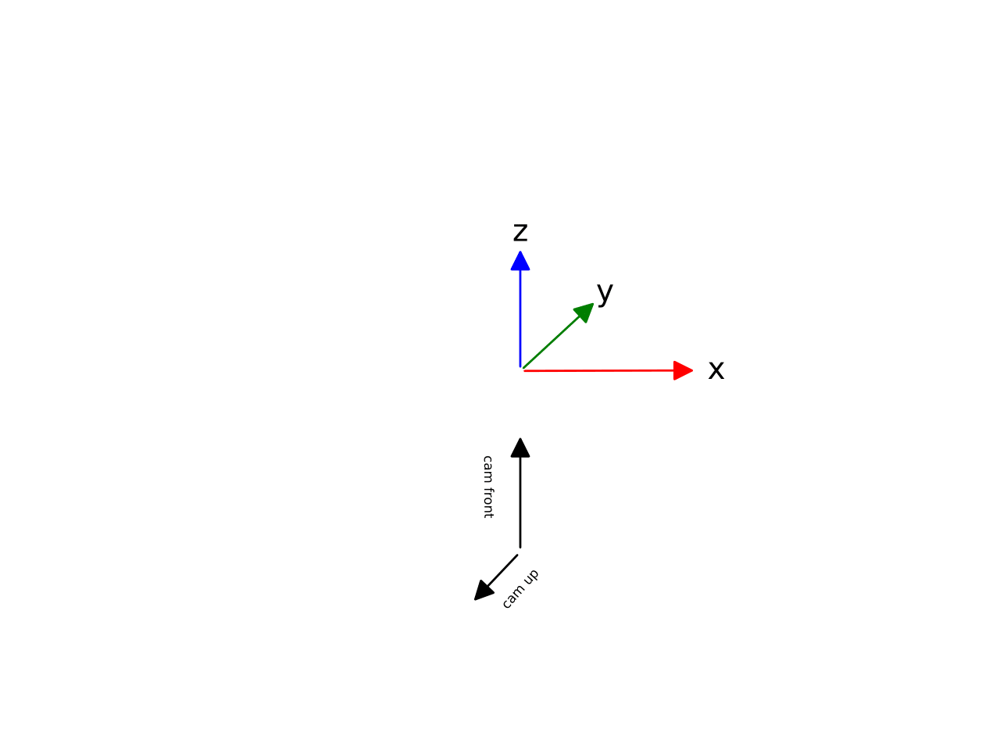

Reality Capture
===============

*Reality Capture* is a 3D reconstruction software developed by Epic
Games, Inc. There are several possibilities to export cameras: XMP, csv
and FBX. Camorph supports the XMP file format, as this is the
only format supported for importing cameras. *Reality Capture* generates
XMP files for every source image in the source image folder. When you
create a new *Reality Capture* project, XMP files in the source image
folder with the same name as the images are imported automatically

Coordinate System
-----------------

| *Reality Capture* supports alignment with all EPSG geodesic coordinate
  systems. In Cartesian world coordinates, it uses z up,
  x right, -y front. The default orientation for cameras
  is z front and -y up. Yaw, Pitch and Roll in *Reality
  Capture* correspond to a rotation around the :math:`z`,\ :math:`y` and
  :math:`x`-axis respectively. Usually, angles are measured in
  counterclockwise direction around an axis. But in *Reality Capture*,
  Yaw is measured clockwise. This means that yaw = 180 - yaw to correct
  for counterclockwise orientation.
| The resulting rotation matrix with :math:`z` = yaw = :math:`\phi`,
  :math:`y` = pitch = :math:`\theta` and :math:`x` = roll = :math:`\psi`
  *Reality Capture* uses internally:

  .. math::

     \begin{pmatrix}
     \cos{\psi}\cos{\phi} + \sin{\psi}\sin{\theta}\sin{\phi} & -\cos{\psi}\sin{\phi} + \cos{\phi}\sin{\psi}\sin{\theta} & -\cos{\theta}\sin{\psi} \\
     -\cos{\theta}\sin{\phi} & -\cos{\theta}\cos{\phi} & -\sin{\theta} \\
     \cos{\psi}\sin{\theta}\sin{\phi} - \cos{\phi}\sin{\psi} & \cos{\psi}\cos{\phi}\sin{\theta} + \sin{\psi}\sin{\phi} & -\cos{\psi}\cos{\theta}
     \end{pmatrix}

  When comparing this matrix to "regular" rotation matrices, note that the only difference to the
  rotation matrix :math:`R_{zxy}` is that :math:`\cos{\theta}` is
  :math:`-\cos{\theta}`. This occurs because
  :math:`\theta = \pi - \theta_{RC}`, as mentioned above. This also
  means that the rotational order *Reality Capture* uses internally is
  :math:`z-x-y` , or :math:`R_y \cdot R_x \cdot R_z`. This is only
  relevant when dealing with .csv files, as the exported angles are the
  angles displayed in *Reality Capture*. The XMP files already supply
  the "correct" rotational matrix.

XMP Files
---------
XMP is a file format based on the `Resource Description Framework <https://www.w3.org/RDF/>`_ (rdf).

The ``rdf:Description`` element has the following important
attributes:

-  ``DistortionModel`` is the name of the distortion model type

-  ``FocalLength35mm`` is the focal length with respect the 135 film
   standard

-  ``Skew`` is the skew parameter in the intrinsic matrix

-  ``AspectRatio`` is the pixel aspect ratio, not the sensor aspect
   ratio, which is 1 most of the time

-  ``PrincipalPointU`` and ``PrincipalPointV`` are the principal point
   coordinates relative to the middle of the image plane and the
   resolution

This element contains three additional elements:

-  ``Rotation`` which is the rotational matrix in row major order.
   It is the inverse of
   :math:`R`, meaning the rotational matrix used in the projection
   equation.

-  ``Position`` is the center of the camera

-  ``DistortionCoeficients``\ (sic) are six distortion parameters based
   on the ``DistortionModel``. There are always six coefficients, with
   unused parameters being zero.

Camera Models
-------------
*Reality Capture* always stores six distortion coefficients. When the
camera model does not support six parameters, the unused parameters are
set to zero. The camera models supported by *Reality Capture* are:

+--------------+--------------------------+------------------------+
| **Name**     | **Description**          | **Parameters**         |
+==============+==========================+========================+
| ``brown3``   | Brown distortion model   | k1, k2, k3, 0, 0, 0    |
|              | with three radial        |                        |
|              | parameters               |                        |
+--------------+--------------------------+------------------------+
| ``brown4``   | Brown distortion model   | k1, k2, k3, k4, 0, 0   |
|              | with four radial         |                        |
|              | parameters               |                        |
+--------------+--------------------------+------------------------+
| ``brown3t2`` | Brown distortion model   | k1, k2, k3, 0, t1, t2  |
|              | with three radial        |                        |
|              | parameters and two       |                        |
|              | tangential parameters    |                        |
+--------------+--------------------------+------------------------+
| ``brown4t2`` | Brown distortion model   | k1, k2, k3, k4, t1, t2 |
|              | with four radial         |                        |
|              | parameters and two       |                        |
|              | tangential parameters    |                        |
+--------------+--------------------------+------------------------+
| ``division`` | Division distortion      | k, 0, 0, 0, 0, 0       |
|              | model                    |                        |
+--------------+--------------------------+------------------------+