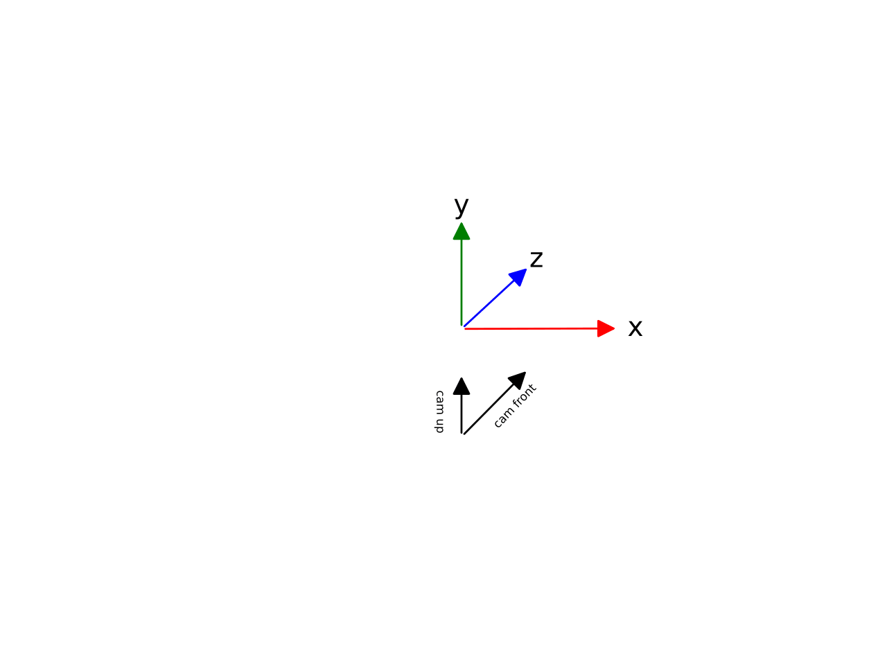

Unity
=====

*Unity* is a free to use multiplatform game engine. Although *Unity* is
not simple to use, it is successfull in being a bridge between technical
computer graphics and usability for ambitious users. It can also be used
to create virtual reality experiences.

Coordinate System
-----------------
The standard *Unity* coordinate system is y up, x right, -z front. The camera orientation is z front and y up.

Unity Scene Files
-----------------
The storage format of *Unity*
scenes are ASCII .unity files, which use a subset of the YAML language
called *UnityYAML*.

*Unity* uses tags at the start of a YAML document to define the object
type and id:

::

   --- !u!1 &6
   GameObject:
       ...

``!u!`` marks the custom *Unity* prefix. The number after ``!u!``
indicates the type of the object. This thesis only focuses on three
types: ``GameObject (6)`` which serves as the parent for the other two,
``Transform (4)`` which represents transformations and ``Camera (20)``
which represents a Camera. The number after ``&`` represents an unique
id.

The ``GameObject`` acts as the parent of the other objects and holds the
information which transform corresponds to which camera.

-  ``m_Component`` is an array of ``component``\ s which hold the ids of
   other objects in the scene.

The ``Transform`` holds extrinsic parameters.

-  ``m_LocalRotation`` is the local rotation as a quaternion

-  ``m_LocalPosition`` is the local position as a vector

-  ``m_LocalScale`` is the local scale as a vector

-  ``m_Father`` is the id of the father transform

-  ``m_Children`` holds an array of ids of child transforms

The ``Camera`` holds intrinsic parameters.

-  ``m_SensorSize`` is the sensor size in mm

-  ``m_LensShift`` is the lens shift relative to the sensor size

-  ``m_FocalLength`` is the focal length in mm

-  ``orthographic`` is a bool indicating whether the camera is a
   perspective or an orthographic camera

