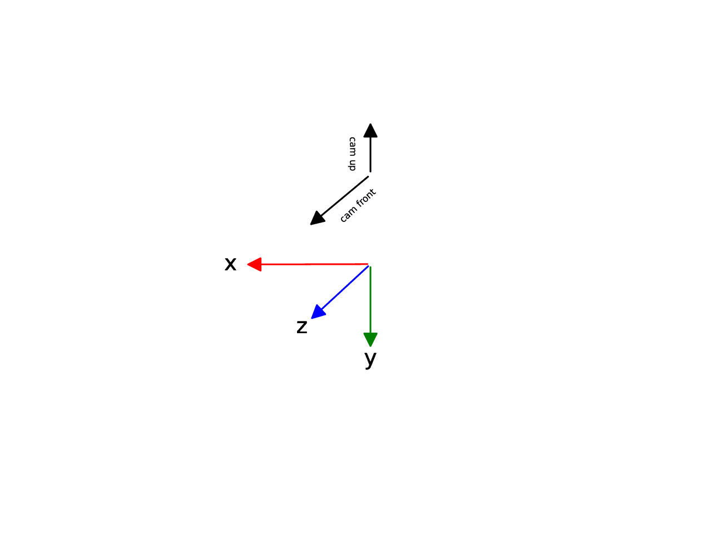

# COLMAP

is a 3D reconstruction software developed by Johannes L. Schönberger   .
The software stores its results in multiple files: A `cameras` file
containing intrinsic parameters, an `images` file containing extrinsic
parameters and a `points3d` file containing all reconstructed 3D
points. The files can be in binary format for faster processing or in
ASCII format for human readability.

## Coordinate system

The default COLMAP coordinate system is z front, -x right and -y up. The default camera direction is z and camera up is -y:




## Cameras file

Example cameras ASCII file:

```default
camera_id camera_model image_width image_height params*
1 SIMPLE_PINHOLE 3072 2304 2559.81 1536 1152
2 PINHOLE 3072 2304 2560.56 2560.56 1536 1152
3 SIMPLE_RADIAL 3072 2304 2559.69 1536 1152 -0.0218531
```

## Images file

Example images ASCII file:

```default
imageId, qw, qx, qy, qz, tx, ty, tz, cameraId, name
points2d[] as (x,y,pointid)
1 0.9238795391929062 0.38268341623423263 -0.0 -0.0 -5.041089999999998 1.2708298199999997 1.4063895899999999 1 view1.png
0 0 0 0 0 0 0 0 0
2 0.7071067811865475 -0.0 0.7071067811865475 -0.0 0.0506335 1.94183 0.594955 2 view1.png
0 0 0 0 0 0 0 0 0
3 0.9238795391929062 -0.0 -0.0 -0.38268341623423263 -3.779291409999999 3.3067953399999994 0.042054899999999985 3 view1.png
0 0 0 0 0 0 0 0 0
```

Note that the rotation $R$ and the translation $t$ are given by:

$$
R = R_c^{-1} \\
t = -Rt_c
$$

where $R_c$ is the rotation matrix built from the quaternion in the images file, and $t_c$ is the translation vector in the images file
## Camera models


<table class="docutils align-default"><colgroup><col style="width: 13%"> <col style="width: 29%"> <col style="width: 29%"> <col style="width: 29%"></colgroup> 

<thead>

<tr class="row-odd">

<th class="head">

**ID**

</th>

<th class="head">

**Name**

</th>

<th class="head">

**Description**

</th>

<th class="head">

**Parameters (in order)**

</th>

</tr>

</thead>

<tbody>

<tr class="row-even">

<td>

0

</td>

<td>

SIMPLE_PINHOLE

</td>

<td>

Simple model without distortion

</td>

<td>

f, cx, cy

</td>

</tr>

<tr class="row-odd">

<td>

1

</td>

<td>

PINHOLE

</td>

<td>

Simple model without distortion but two focal length parameters

</td>

<td>

fx, fy, cx, cy

</td>

</tr>

<tr class="row-even">

<td>

2

</td>

<td>

SIMPLE_RADIAL

</td>

<td>

Radial model with one distortion parameter. Similar to VisualSfM, with the difference that the distortion is applied to the projections

</td>

<td>

f, cx, cy, k

</td>

</tr>

<tr class="row-odd">

<td>

3

</td>

<td>

RADIAL

</td>

<td>

Radial model with two distortion parameters. The same model that Bundler uses

</td>

<td>

f, cx, cy, k1, k2

</td>

</tr>

<tr class="row-even">

<td>

4

</td>

<td>

OPENCV

</td>

<td>

A simple brown camera model with two radial and two tangential distortion parameters

</td>

<td>

fx, fy, cx, cy, k1, k2, p1, p2

</td>

</tr>

<tr class="row-odd">

<td>

5

</td>

<td>

OPENCV_FISHEYE

</td>

<td>

An OpenCV fisheye camera model with two radial and two tangential distortion parameters

</td>

<td>

fx, fy, cx, cy, k1, k2, k3, k4

</td>

</tr>

<tr class="row-even">

<td>

6

</td>

<td>

FULL_OPENCV

</td>

<td>

The full OpenCV camera model with six radial and two tangential distortion parameters

</td>

<td>

fx, fy, cx, cy, k1, k2, p1, p2, k3, k4, k5, k6

</td>

</tr>

<tr class="row-odd">

<td>

7

</td>

<td>

FOV

</td>

<td>

The field of view distortion model used in project tango and described by Klein et. al.

</td>

<td>

fx, fy, cx, cy, omega

</td>

</tr>

<tr class="row-even">

<td>

8

</td>

<td>

SIMPLE _RADIAL_FISHEYE

</td>

<td>

A simple OpenCV fisheye model with one radial distortion coefficient

</td>

<td>

f, cx, cy, k

</td>

</tr>

<tr class="row-odd">

<td>

9

</td>

<td>

RADIAL_FISHEYE

</td>

<td>

A simple OpenCV fisheye model with two radial distortion coefficients

</td>

<td>

f, cx, cy, k1, k2

</td>

</tr>

<tr class="row-even">

<td>

10

</td>

<td>

THIN _PRISM_FISHEYE

</td>

<td>

A camera model with radial and tangential distortion coefficients and additional thin-prism distortion coefficients as described by Weng et. al.

</td>

<td>

fx, fy, cx, cy, k1, k2, p1, p2, k3, k4, sx1, sy1

</td>

</tr>

</tbody>

</table>

<dl class="footnote brackets">

<dt class="label" id="id3"><span class="brackets">[1](#id1)</span></dt>

<dd>

Schönberger, Johannes Lutz and Frahm, Jan-Michael. “Structure-from-Motion Revisited”. In: <cite>Conference on Computer Vision and Pattern Recognition (CVPR)</cite>. Las Vegas, NV, USA, June 2016.

</dd>

<dt class="label" id="id4"><span class="brackets">[2](#id2)</span></dt>

<dd>

Schönberger, Johannes Lutz et al. “Pixelwise View Selection for Unstructured Multi-View Stereo”. In: <cite>European Conference on Computer Vision (ECCV)</cite>. The Netherlands, Amsterdam, Oct. 2016

</dd>

</dl>

</div>