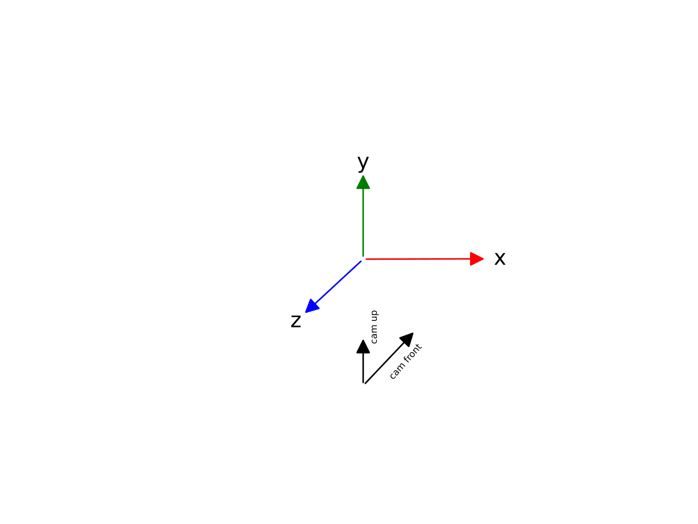

# Meshroom

*Meshroom* is a 3D reconstruction software developed by Griwodz et. al.
The software has a nodal architecture and stores intermediate results in
a specific subfolder structure. Each nodes data is stored in a folder
with its unique identifier as a name in a subfolder of the node type in
the folder `MeshroomCache`. The reconstructed camera poses are stored
in `cameras.sfm` in the `StructureFromMotion` folder. Known poses
can be imported into Mehsroom by setting the input of a
`FeatureExtraction` node to the custom `cameras.sfm` file.

## Coordinate System

The standard *Meshroom* coordinate system is y up, x right, z front. The camera orientation is -z front and y up.

## SfM File

The SfM file uses the widespread JSON format.

* `featuresFolders` and `matchesFolders` point to specific folders
in the *Meshroom* folder structure, and should be left empty when
writing a custom file.

* `views` holds view objects which hold data of a source image used
for reconstruction in *Meshroom*.

    * `viewId` is a unique identifier

    * `poseId` refers to a pose object in `poses` where extrinsic
parameters are stored

    * `intrinsicId` refers to an intrinsic object in `intrinsics`
where intrinsic parameters are stored

    * `path` refers to the file path of the source image

    * `width` and `height` are the width and height of the image

    * `metadata` holds metadata about the image which is not relevant
in this thesis.

* `intrinsics` holds intrinsic objects which store intrinsic
parameters of a specific camera model

    * `intrinsicId` is a unique identifier

    * `width` and `height` the resolution of the camera

    * `sensorWidth` and `sensorHeight` the size of the sensor in mm

    * `serialNumber` the serial number of the camera the source image
was taken with

    * `type` the name of the distortion model type

    * `initializationMode` one of `calibrated` for externally
calibrated cameras, `estimated` for estimated cameras,
`unknown` for unkown cameras with guess values or `none` for
none

    * `pxInitialFocalLength` is the initial guess of the focal length
in px

    * `pxFocalLength` is the focal length in px

    * `principalPoint` is the principal point in px

    * `distortionParams` are the distortion params of the camera model

    * `locked` is a bool if the intrinsic objects parameters are
locked or can be modified

* `poses` holds pose objects which store extrinsic parameters of a
specific pose

    * `poseId` is a unique identifier

    * `pose` is a nested pose object

        * `transform` stores the rotation as `rotation` as a matrix
in row major order and the translation as `center` as a
three-dimensional vector

    * `locked` is a bool if the pose objects parameters are locked or
can be modified

## Camera Models

Meshroom supports the following camera models:

<table class="docutils align-default"><colgroup><col style="width: 30%"> <col style="width: 35%"> <col style="width: 35%"></colgroup> 

<thead>

<tr class="row-odd">

<th class="head">

**Name**

</th>

<th class="head">

**Description**

</th>

<th class="head">

**Parameters**

</th>

</tr>

</thead>

<tbody>

<tr class="row-even">

<td>

`pinhole`

</td>

<td>

Pinhole model without distortion coefficients

</td>

<td></td>

</tr>

<tr class="row-odd">

<td>

`radial1`

</td>

<td>

Brown model with one radial coefficient

</td>

<td>

k1

</td>

</tr>

<tr class="row-even">

<td>

`radial3`

</td>

<td>

Brown model with three radial coefficients

</td>

<td>

k1, k2, k3

</td>

</tr>

<tr class="row-odd">

<td>

`brown`

</td>

<td>

Brown model with three radial and two tangential coefficients

</td>

<td>

k1, k2, k3, t1, t2

</td>

</tr>

<tr class="row-even">

<td>

`fisheye`

</td>

<td>

OpenCV fisheye distortion model with 4 coefficients

</td>

<td>

k1, k2, k3, k4

</td>

</tr>

<tr class="row-odd">

<td>

`equidistant_r3`

</td>

<td>

Camera model used for fisheye optics with distortion provided in [1](#id2)

</td>

<td>

w

</td>

</tr>

<tr class="row-even">

<td>

`3deanamorphic4`

</td>

<td>

Anamorphic camera model with 4 coefficients used by 3D Equalizer

</td>

<td>

cxx, cxy, cyx, cyy

</td>

</tr>

<tr class="row-odd">

<td>

`3declassicld`

</td>

<td>

Anamorphic camera model with 10 coefficients used by 3D Equalizer

</td>

<td>

delta, epsilon, mux, muy, q

</td>

</tr>

<tr class="row-even">

<td>

`3deradial4`

</td>

<td>

Radial camera model with used by 3D Equalizer

</td>

<td>

c2, c4, u1, v1, u3, v3

</td>

</tr>

</tbody>

</table>

<dl class="footnote brackets">

<dt class="label" id="id2">[1]</dt>

<dd>

Devernay, Frédéric and Faugeras, Olivier. “Straight Lines Have to Be Straight Automatic Calibration and Removal of Distortion from Scenes of Structured Envi- ronments”. In: _Mach Vis Appl 13 (Aug. 2001)_. doi: 10.1007/PL00013269

</dd>

</dl>