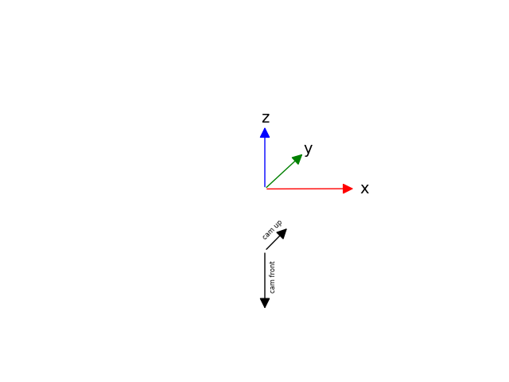

# NeRF

*NeRF* s (Neural Radiance Fields) are a novel way of representing a 3D scene via a fully connected neural network, trained on a set of 2D Images.

## Coordinate System

The standard *NeRF* coordinate system is z up,
x right, -y front. The camera orientation is
-z front and y up

## JSON File

There are many different version of *NeRF* JSON files. This one is a custom version based on InstantNGP by NVIDIA.

The top level holds global information:

* `camera_angle_x` and `camera_angle_y` are the respective fovs in radians

* `fl_x` and `fl_y` are the respective focal lengths in pixels

* `k1`, `k2`, `k3`, `p1`, `p2`, `p3` are distortion parameters

* `cx` and `cy` is the location of the principal point in pixels

* `w` and `h` is the size of one image

* `aabb_scale` the size of the axis aligned bounding box (currently unused)

`frames` contains the information for each camera:

* `intrinsics` holds individual intrinsic information about the camera if it is other than the global information

* `file_path` is the path to the source image

* `rotation` is a currently unused rotation parameter always set to 0, but required by some *NeRF* models

* `transform_matrix` is the 4x4 transformation matrix
