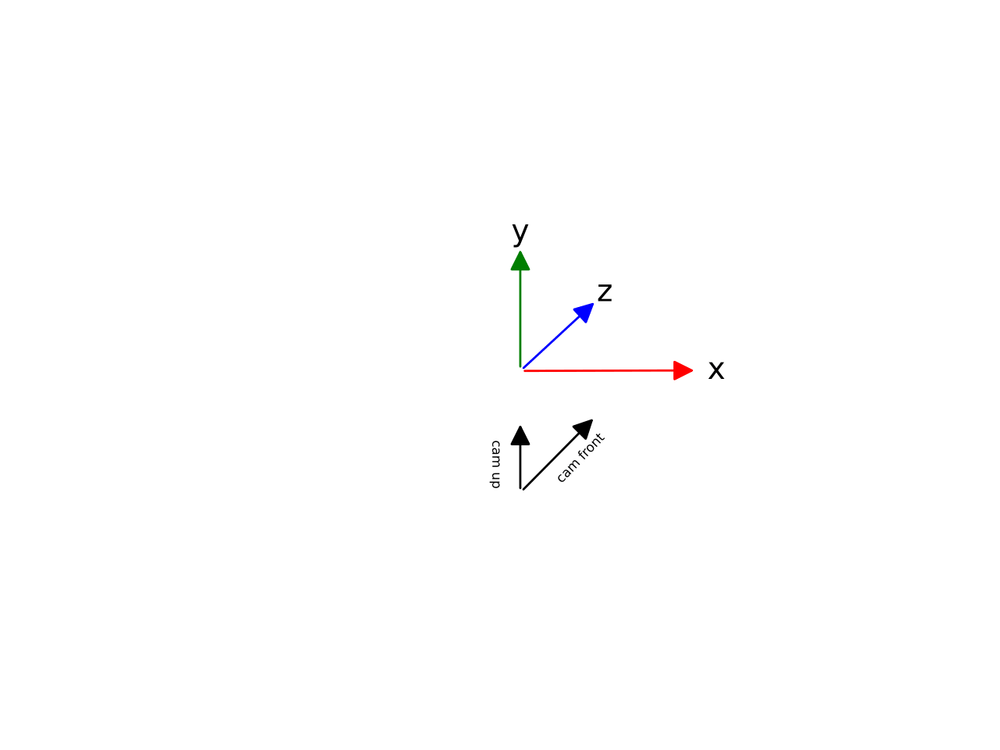

# Unity

*Unity* is a free to use multiplatform game engine. Although *Unity* is
not simple to use, it is successfull in being a bridge between technical
computer graphics and usability for ambitious users. It can also be used
to create virtual reality experiences.

## Coordinate System

The standard *Unity* coordinate system is y up, x right, -z front. The camera orientation is z front and y up.




## Unity Scene Files

The storage format of *Unity*
scenes are ASCII .unity files, which use a subset of the YAML language
called *UnityYAML*.

*Unity* uses tags at the start of a YAML document to define the object
type and id:

```default
--- !u!1 &6
GameObject:
    ...
```

`!u!` marks the custom *Unity* prefix. The number after `!u!`
indicates the type of the object. This thesis only focuses on three
types: `GameObject (6)` which serves as the parent for the other two,
`Transform (4)` which represents transformations and `Camera (20)`
which represents a Camera. The number after `&` represents an unique
id.

The `GameObject` acts as the parent of the other objects and holds the
information which transform corresponds to which camera.


* `m_Component` is an array of `component`s which hold the ids of
other objects in the scene.

The `Transform` holds extrinsic parameters.


* `m_LocalRotation` is the local rotation as a quaternion


* `m_LocalPosition` is the local position as a vector


* `m_LocalScale` is the local scale as a vector


* `m_Father` is the id of the father transform


* `m_Children` holds an array of ids of child transforms

The `Camera` holds intrinsic parameters.


* `m_SensorSize` is the sensor size in mm


* `m_LensShift` is the lens shift relative to the sensor size


* `m_FocalLength` is the focal length in mm


* `orthographic` is a bool indicating whether the camera is a
perspective or an orthographic camera
